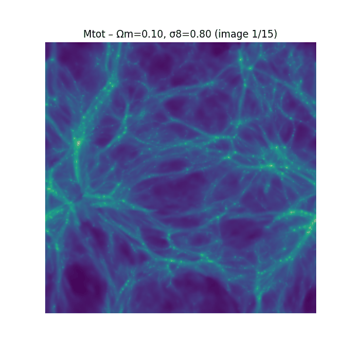
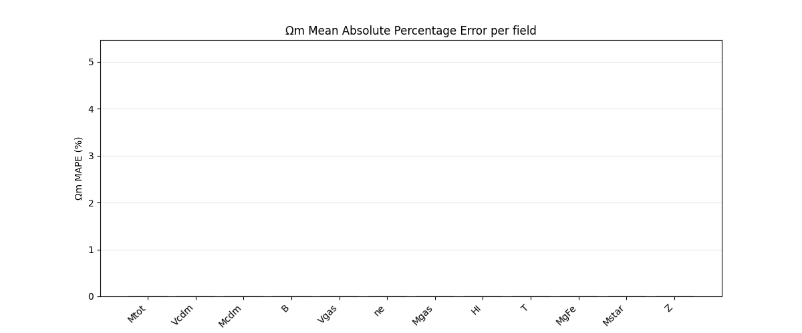
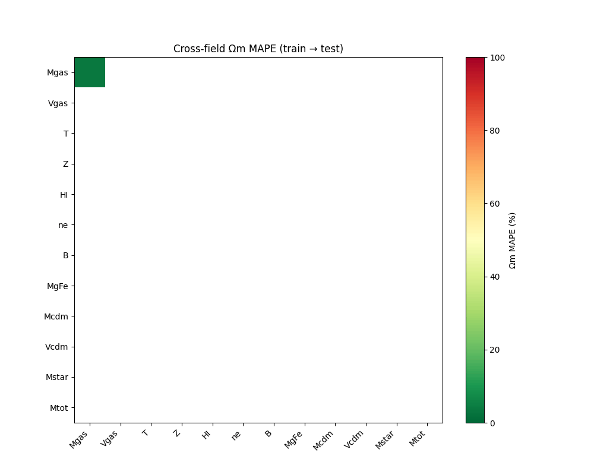

# Astrophysics-and-Cosmology-with-Machine-Learning
## 🎥 Model Visualisations

### 1. Cosmic Variance – Mtot Field (15 Realisations)

*Fifteen different realisations of the same cosmological parameters (Ωm, σ8) illustrate the intrinsic “cosmic variance” the model must learn to ignore.*

### 2. Single‑Field Performance – Ωm MAPE

*Bars rise to the final Mean Absolute Percentage Error for Ωm across all 12 fields. Mtot and Mcdm are the best performers.*

### 3. Cross‑Field Generalisation Heatmap

*MAPE matrix fills in cell by cell, showing how models trained on one field generalise to others. Dark matter fields transfer best.*
# Understanding the Universe with CAMELS

**Abstract:** In this project, I applied convolutional neural networks (CNNs) to infer cosmological parameters, Ωm and σ8, from cosmological hydrodynamical 2D maps provided by the CAMELS IllustrisTNG 1P dataset, which includes 12 astrophysical fields with 990 images per field.

Single field results demonstrated the significance of field-dependent astrophysical effects, with astrophysically contaminated fields (Z, Mstar, MgFe) performing worse across both parameters with a Mean Absolute Percentage Error (MAPE) range of 3.5- 5%, and matter-dominated fields (Mtot, Mcdm) attaining the lowest MAPE range of 1.2-2.2 %. Additionally, σ8 (2.35% mean MAPE) demonstrated higher predictability and generalisability than Ωm (3.41% mean MAPE).

The multi-field model, trained on all 12 maps, achieved MAPE of 2.3% for Ωm and 1.6% for σ8, on par with the most optimal single field model Mtot , with 1.9% Ωm and 1.2% σ8 error, and outperformed representative subset combinations of the single fields.

Cross-field analysis, where models trained on one field were used to predict another, revealed that the matter density map (Mcdm) as an all-around field, both easy to predict and generalising well, the Mgas field’s asymmetrical behaviour, and confirmed field clustering across similar fields, with velocity maps (Vgas and Vcdm), gas maps (Z and T), and matter density maps (Mcdm and Mtot) displaying high predictability and generalisability regardless of any variations in test-training order.
